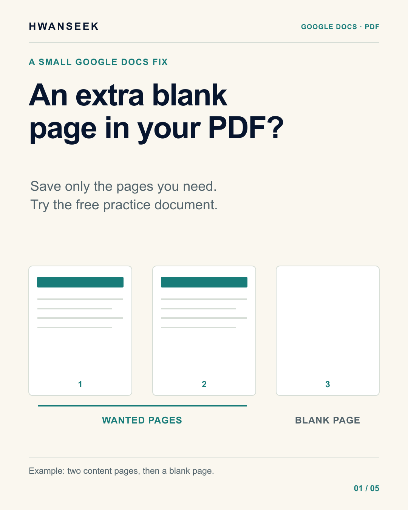
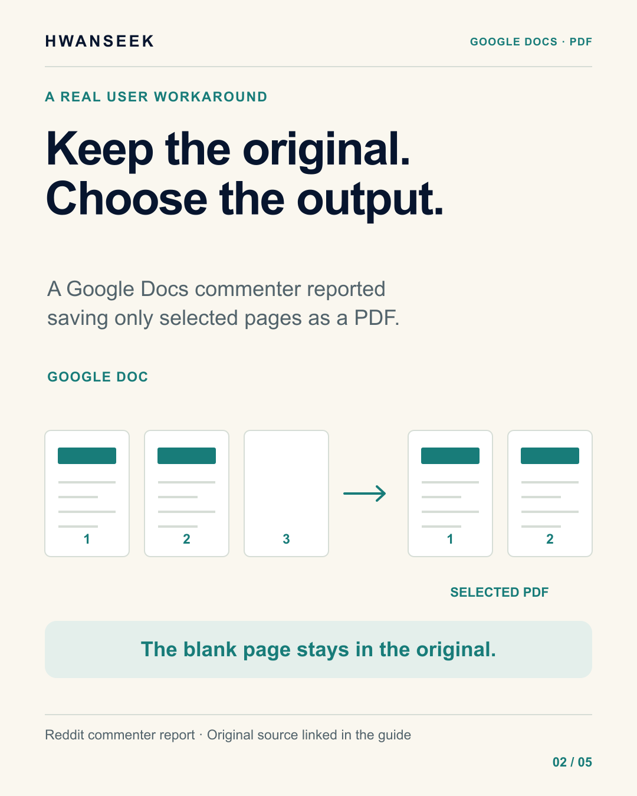
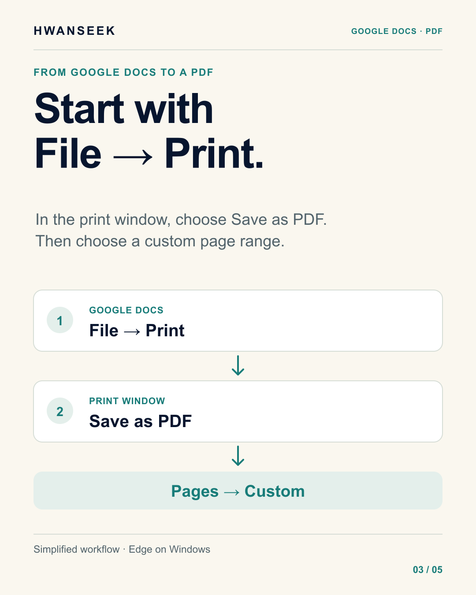
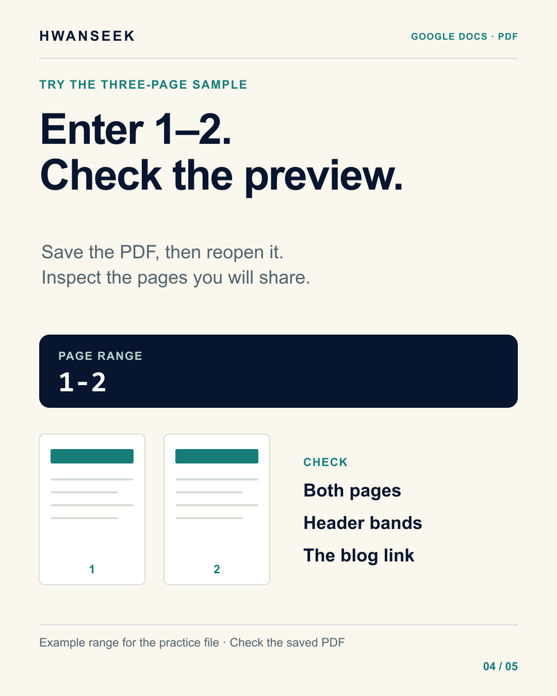
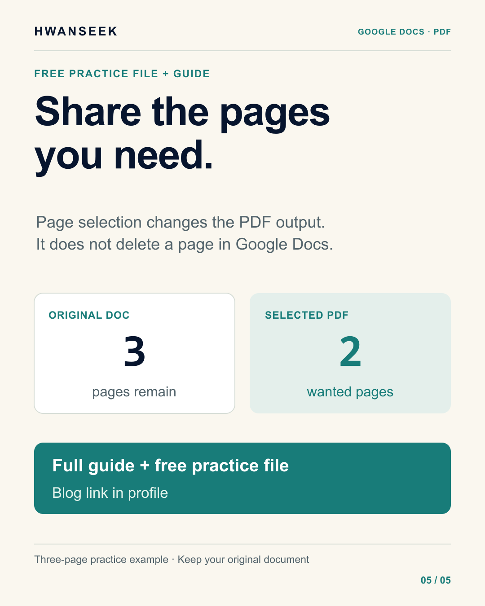

# Save only the Google Docs pages you need as a PDF

If your Google document ends with an unwanted blank page, choose the wanted pages when saving a PDF. You can keep the original document intact while making a shorter file to share.

This guide covers Google Docs in Microsoft Edge on Windows. Use the [practice DOCX](google-docs-pdf-page-range-practice.docx) and compare your result with the [checked two-page PDF](google-docs-selected-pages-verified.pdf).

## The user problem

In a [Google Docs Reddit discussion](https://www.reddit.com/r/googledocs/comments/1g4xvay/blank_page_cannot_be_deleted/), the original poster could not remove a final blank page despite checking margins and trying Delete. Showing non-printing characters helped that person. A different commenter reported using Print, Save as PDF and selected page numbers to leave out the unwanted page.

Repairing the document and choosing its PDF pages solve different needs. If your goal is a clean PDF now, selecting pages avoids having to change the original layout first.

## Compare the work

If you currently download a complete PDF, reopen it and save another PDF without the blank page, choose the page range during the print step instead:

**Google Docs → File → Print → Save as PDF → custom page range → Save.**

You should still reopen the saved file before sharing it.

## Try the practice file

1. Open the practice DOCX in [Google Docs](https://docs.google.com/). Google supports working with [Office files in Drive and Docs on the web](https://support.google.com/drive/answer/9406611?hl=en-GB).
2. Check **File → Page setup → Pages** and inspect the imported layout. The sample has two content pages and a blank final page.
3. Choose **File → Print** in the Google Docs menu.
4. In the print window, choose **Save as PDF** as the printer or destination.
5. Under **Pages**, choose the custom range option and enter **1-2**.
6. Check that the preview includes only those two pages, save a clearly named PDF, then reopen it.

Your saved file should end on the checklist page. Check that both green bands and all text remain. Inspect the first-page hyperlink; its target should be https://hwanseek.blogspot.com/.

[Google Docs printing help](https://support.google.com/docs/answer/143346?hl=en-CA) documents the document's Print command. [Microsoft Edge printing help](https://support.microsoft.com/en-us/edge/print-in-microsoft-edge) documents custom page ranges.

## What we checked

On September 9, 2026, the account owner manually saved pages 1-2 in Edge 152 on Windows. An AI assistant inspected that actual PDF and rendered both pages for visual review. The file has exactly two Letter-size pages. Its text matches the first two pages of the full Google Docs export after normalizing whitespace; both green bands and the exact hyperlink target remain.

The full Google Docs export contained three pages. An earlier Edge save without changing the page selection produced four pages, including two blanks. We did not diagnose that extra blank page. Selecting 1-2 produced the checked two-page file supplied here.

## What remains outside this fix

The original document retains its pages. To diagnose its blank page, use **View → Show non-printing characters** and inspect paragraph, page and section breaks. Work on a copy before making formatting changes. [Google's explanation of non-printing characters](https://support.google.com/docs/answer/6367684?co=GENIE.Platform%3DDesktop&hl=en).

Google documents different print behavior for Firefox and Safari, which can download a PDF first. Pageless documents may print differently from the editing view. Other browsers, mobile workflows and multi-tab documents were not tested here.

Importing a Word template can change its layout. This simple sample does not prove that every template will retain identical pagination or formatting.

## Card guide

These are instructional diagrams, not app screenshots.

